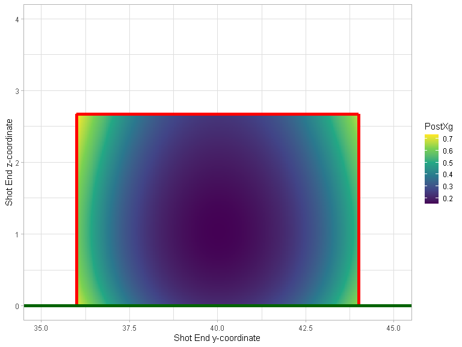
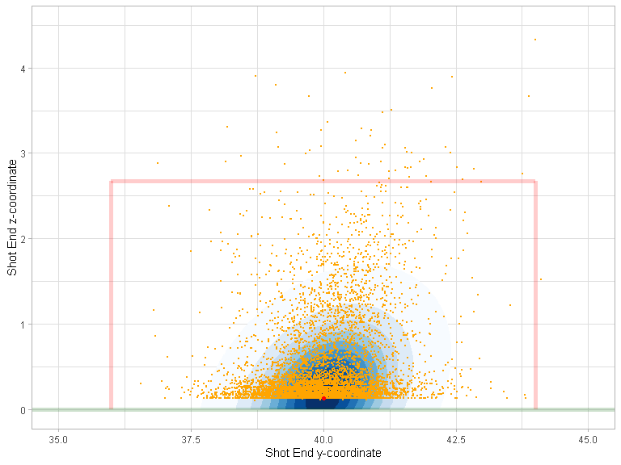
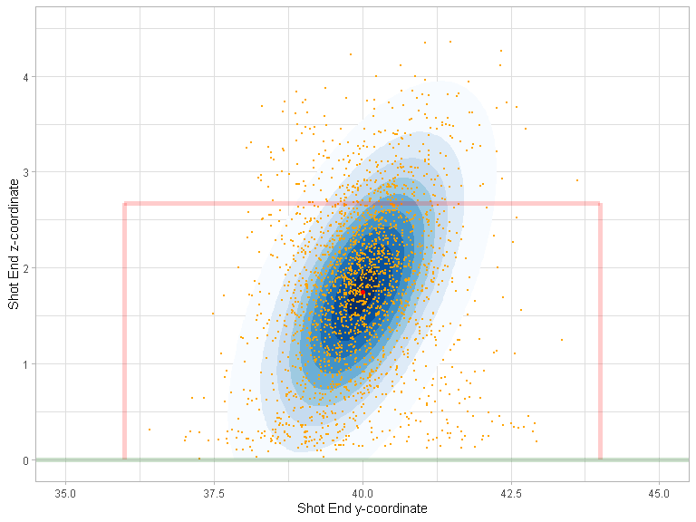

Miss It Like Messi
================

``` r
devtools::load_all()
#> i Loading shotmissr
#> Warning: Objects listed as exports, but not present in namespace:
#> * global_weights
#> * shot_metrics
```

## Table 1

``` r
statsbomb_shots_processed |>
  prepare_shooting_skill_data() |>
  dplyr::group_by(League, Season) |>
  dplyr::summarise(num_shots = dplyr::n(), .groups = "keep") |>
  knitr::kable()
```

| League | Season | num_shots |
|:-------|-------:|----------:|
| ARG    |   2019 |      2366 |
| FR2    |   2018 |      2892 |
| FR2    |   2019 |      2264 |
| FR2    |   2020 |      2824 |
| GR2    |   2018 |      2566 |
| GR2    |   2019 |      2646 |
| GR2    |   2020 |      2443 |
| MLS    |   2018 |      3552 |
| MLS    |   2019 |      3829 |
| MLS    |   2020 |      2620 |
| NED    |   2018 |      2774 |
| NED    |   2019 |      2136 |
| NED    |   2020 |      2603 |
| USL    |   2019 |      1701 |
| USL    |   2020 |      2332 |

## Figure 1

``` r
statsbomb_shots_processed |>
  dplyr::filter(League == "MLS", Season == 2018) |>
  dplyr::filter(!is.na(z_end)) |>
  ggplot2::ggplot() +
  ggplot2::geom_point(mapping = ggplot2::aes(
    x = y_end,
    y = z_end,
    color = outcome)) +
  plot_goalposts(color = "red", cex = 2, alpha = 0.2) +
  ggplot2::theme_bw()
```

<!-- -->

## Figure 2

``` r
statsbomb_shots_processed |>
  dplyr::filter(League == "USL", Season == 2020) |>
  dplyr::filter(!is.na(z_end)) |>
  dplyr::filter(grepl("Saved", outcome)) |>
  ggplot2::ggplot() +
  ggplot2::geom_point(mapping = ggplot2::aes(
    x = y_end,
    y = z_end,
    color = outcome)) +
  plot_goalposts(color = "red", cex = 2, alpha = 0.2) +
  ggplot2::theme_bw()
```

<!-- -->

``` r

statsbomb_shots_processed |>
  dplyr::filter(League == "USL", Season == 2020) |>
  dplyr::filter(!is.na(z_end)) |>
  dplyr::filter(grepl("Saved", outcome)) |>
  ggplot2::ggplot() +
  ggplot2::geom_point(mapping = ggplot2::aes(
    x = y_end_proj,
    y = z_end_proj,
    color = outcome)) +
  plot_goalposts(color = "red", cex = 2, alpha = 0.2) +
  ggplot2::theme_bw()
```

<!-- -->

## Figure 5

``` r
yy <- seq(y_left_post(), y_right_post(), by = 0.1)
zz <- seq(0, z_crossbar(), by = 0.03)
shots <- expand.grid(y = yy, z = zz)
shots |>
  dplyr::mutate(post_shot_xg = predict_post_xg(y, z)) |>
  ggplot2::ggplot() +
  ggplot2::geom_contour_filled(mapping = ggplot2::aes(
    x = y,
    y = z,
    z = post_shot_xg), bins = 100, show.legend = FALSE) +
  plot_goalposts(color = "red", cex = 2) +
  ggplot2::theme_bw()
```

<!-- -->

## Figure 7

``` r
statsbomb_shots |>
  dplyr::filter(League == "MLS", Season == 2018) |>
  dplyr::filter(!is.na(z_end)) |>
  ggplot2::ggplot() +
  ggplot2::geom_point(mapping = ggplot2::aes(
    x = y_end,
    y = z_end,
    color = outcome)) +
  plot_goalposts(color = "red", cex = 2, alpha = 0.2) +
  ggplot2::theme_bw()
```

<!-- -->

## Figure 8

``` r
z_target <- sort(unique(Hunter_et_al_2018_shots$target_height_yards))
cat("Execution error covariance matrices:")
#> Execution error covariance matrices:
get_execution_error_covariance(z_target[1])
#>           [,1]      [,2]
#> [1,] 0.7036574 0.1566326
#> [2,] 0.1566326 0.2969795
get_execution_error_covariance(z_target[2])
#>           [,1]      [,2]
#> [1,] 0.7815552 0.4417238
#> [2,] 0.4417238 0.7419683

yy = seq(34, 46, length.out = 100)
zz = seq(0, 4, length.out = 100)
yz = expand.grid(y = yy, z = zz)

gaussians <- yz |>
  dplyr::mutate(
    prob_low = tmvtnorm::dtmvnorm(
      x = as.matrix(yz),
      mean = c(y_center_line(), z_target[1]), 
      sigma = get_execution_error_covariance(z_target[1]), 
      lower = c(-Inf, 0)
    ),
    prob_high = tmvtnorm::dtmvnorm(
      x = as.matrix(yz),
      mean = c(y_center_line(), z_target[2]), 
      sigma = get_execution_error_covariance(z_target[2]), 
      lower = c(-Inf, 0)
    )
  )

Hunter_et_al_2018_shots |>
  # Get low-target shots
  dplyr:::filter(target_height_yards == z_target[1]) |>
  dplyr::mutate(
    y_end = y_center_line() + horizontal_error_yards,
    z_end = target_height_yards + vertical_error_yards
  ) |>
  ggplot2::ggplot() +
  # Add contour plot of Gaussian
  ggplot2::geom_contour_filled(
    data = gaussians,
    mapping = ggplot2::aes(x = y, y = z, z = prob_low),
    breaks = seq(0.01, 0.7, by = 0.07)
  ) +
  # Make Gaussian contour colour blue
  ggplot2::scale_fill_brewer() +
  # Add observed shots
  ggplot2::geom_point(
    mapping = ggplot2::aes(
      x = y_end,
      y = z_end), 
    colour = "orange", size = 0.5
  ) +
  # Add target location
  ggplot2::geom_point(x = y_center_line(), y = z_target[1], colour = "red") +
  plot_goalposts(color = "red", cex = 2, alpha = 0.2) +
  ggplot2::theme_bw()
```

<!-- -->

``` r

Hunter_et_al_2018_shots |>
  # Get high-target shots
  dplyr:::filter(target_height_yards == z_target[2]) |>
  dplyr::mutate(
    y_end = y_center_line() + horizontal_error_yards,
    z_end = target_height_yards + vertical_error_yards
  ) |>
  ggplot2::ggplot() +
  # Add contour plot of Gaussian
  ggplot2::geom_contour_filled(
    data = gaussians,
    mapping = ggplot2::aes(x = y, y = z, z = prob_high),
    breaks = seq(0.01, 0.3, by = 0.03)
  ) +
  # Make Gaussian contour colour blue
  ggplot2::scale_fill_brewer() +
  # Add observed shots
  ggplot2::geom_point(
    mapping = ggplot2::aes(
      x = y_end,
      y = z_end), 
    colour = "orange", size = 0.5
  ) +
  # Add target location
  ggplot2::geom_point(x = y_center_line(), y = z_target[2], colour = "red") +
  plot_goalposts(color = "red", cex = 2, alpha = 0.2) +
  ggplot2::theme_bw()
```

<!-- -->

## Figure 3

``` r
mixture_model_components <- get_mixture_model_components()

mixture_model_components[selected_components,] |>
  dplyr::mutate(
    y = purrr::map_dbl(mean, ~.[[1]]),
    z = purrr::map_dbl(mean, ~.[[2]]),
    weight = global_weights,
    lambda = as.factor(lambda)
  ) |>
  dplyr::filter(weight > 0.012) |>
  ggplot2::ggplot(ggplot2::aes(x = y, y = z, alpha = weight, size = lambda)) +
  ggplot2::geom_point(colour = "blue") +
  ggplot2::scale_size_manual(values = c(3, 7)) +
  plot_goalposts(color = "red", cex = 2, alpha = 0.2) +
  ggplot2::theme_bw()
```

<!-- -->

## Calculate player metrics

``` r
half_season_stats <- shot_metrics |>
  dplyr::mutate(SBPostXg = ifelse(is.na(SBPostXg), 0, SBPostXg)) |>
  dplyr::mutate(goal_pct = (outcome == "Goal")) |>
  dplyr::mutate(
    gax = goal_pct - SBPreXg,
    ega = SBPostXg - SBPreXg
  ) |>
  dplyr::group_by(player, Season, first_half_season) |>
  dplyr::summarise(
    dplyr::across(dplyr::matches("goal_pct|gax|ega|_xg"), mean, na.rm = TRUE),
    n = dplyr::n(),
    .groups = "keep"
  )
```

## Table 3

``` r
stability_data <- half_season_stats |>
  dplyr::inner_join(half_season_stats, by = c("player", "Season"), suffix = c("_a", "_b")) |>
  dplyr::filter(first_half_season_a, !first_half_season_b) |>
  dplyr::ungroup()

stability_data |>
  # Get metrics only
  dplyr::select(
    dplyr::starts_with("goal_pct"),
    dplyr::starts_with("gax"),
    dplyr::starts_with("ega"),
    dplyr::matches("_xg")
  ) |>
  # Get correlation matrix
  cor() |>
  # Subset correlation matrix so season A is rows and season B is columns
  data.frame() |>
  dplyr::select(dplyr::ends_with("_a")) |>
  t() |>
  data.frame() |>
  dplyr::select(dplyr::ends_with("_b")) |>
  as.matrix() |>
  knitr::kable()
```

|               | goal_pct_b |     gax_b |      ega_b | rb_post_xg_b | gen_post_xg_b |
|:--------------|-----------:|----------:|-----------:|-------------:|--------------:|
| goal_pct_a    |  0.0504398 | 0.0479698 |  0.0099914 |    0.0072382 |     0.0107215 |
| gax_a         |  0.0434784 | 0.0444193 | -0.0000781 |   -0.0018262 |     0.0006315 |
| ega_a         |  0.0371670 | 0.0322199 |  0.0072857 |    0.0117910 |     0.0165535 |
| rb_post_xg_a  |  0.0356349 | 0.0316687 | -0.0015131 |    0.0699952 |     0.0805474 |
| gen_post_xg_a |  0.0394548 | 0.0332513 | -0.0012836 |    0.0840899 |     0.0883617 |

## Table 4

``` r
stability_data |>
  dplyr::filter(n_a + n_b >= 30) |>
  # Get metrics only
  dplyr::select(
    dplyr::starts_with("goal_pct"),
    dplyr::starts_with("gax"),
    dplyr::starts_with("ega"),
    dplyr::matches("_xg")
  ) |>
  # Get correlation matrix
  cor() |>
  # Subset correlation matrix so season A is rows and season B is columns
  data.frame() |>
  dplyr::select(dplyr::ends_with("_a")) |>
  t() |>
  data.frame() |>
  dplyr::select(dplyr::ends_with("_b")) |>
  as.matrix() |>
  knitr::kable()
```

|               | goal_pct_b |      gax_b |     ega_b | rb_post_xg_b | gen_post_xg_b |
|:--------------|-----------:|-----------:|----------:|-------------:|--------------:|
| goal_pct_a    |  0.0909079 |  0.0731302 | 0.1085867 |   -0.0526890 |     0.0002168 |
| gax_a         |  0.0769423 |  0.0614395 | 0.0898154 |   -0.0426120 |    -0.0012271 |
| ega_a         | -0.0320833 | -0.0411309 | 0.0630560 |    0.0417377 |     0.0361398 |
| rb_post_xg_a  | -0.0063821 | -0.0154622 | 0.1170909 |    0.1417057 |     0.1897055 |
| gen_post_xg_a |  0.0403484 |  0.0326014 | 0.1230452 |    0.1680108 |     0.2002205 |

## Figure 6

``` r
get_stability_above_threshold <- function(metric, n) {
  filtered_data <- stability_data |>
    dplyr::filter(n_a + n_b >= n)
  
  # TODO bootstrap rows here to get estimate of lower and upper bound
  
  cor(filtered_data[[paste0(metric, "_a")]], filtered_data[[paste0(metric, "_b")]])
}

expand.grid(threshold = 6:60, metric = c("gax", "ega", "rb_post_xg", "gen_post_xg")) |>
  dplyr::mutate(
    stability = purrr::map2_dbl(threshold, metric, ~ get_stability_above_threshold(.y, .x))
  ) |>
  ggplot2::ggplot(ggplot2::aes(x = threshold, y= stability, colour = metric)) +
  ggplot2::geom_line() +
  ggplot2::theme_bw()
```

<!-- -->

``` r
# TODO Use geom_ribbon here to add custom error bars returned by get_stability_above_threshold
```
