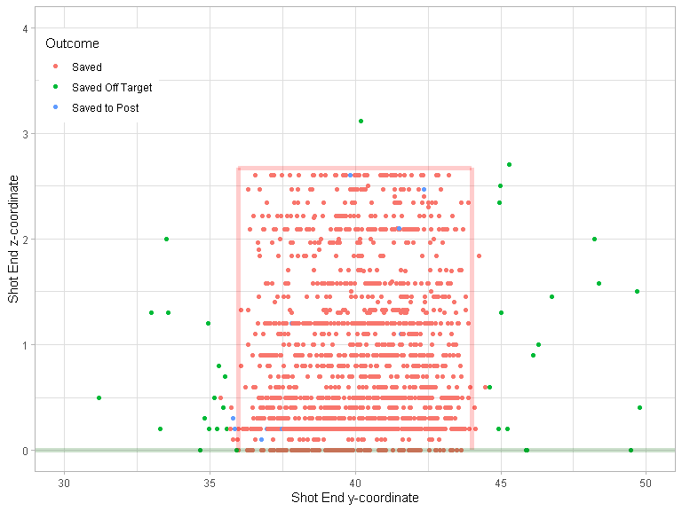

Miss It Like Messi
================

``` r
devtools::load_all()
#> i Loading shotmissr
```

## Table 1

``` r
statsbomb_shots_processed |>
  prepare_shooting_skill_data() |>
  dplyr::group_by(League, Season) |>
  dplyr::summarise(num_shots = dplyr::n(), .groups = "keep") |>
  knitr::kable()
```

| League | Season | num_shots |
|:-------|-------:|----------:|
| ARG    |   2019 |      2366 |
| FR2    |   2018 |      2892 |
| FR2    |   2019 |      2264 |
| FR2    |   2020 |      2824 |
| GR2    |   2018 |      2566 |
| GR2    |   2019 |      2646 |
| GR2    |   2020 |      2443 |
| MLS    |   2018 |      3552 |
| MLS    |   2019 |      3829 |
| MLS    |   2020 |      2620 |
| NED    |   2018 |      2774 |
| NED    |   2019 |      2136 |
| NED    |   2020 |      2603 |
| USL    |   2019 |      1701 |
| USL    |   2020 |      2332 |

## Figure 1

``` r
statsbomb_shots_processed |>
  dplyr::filter(League == "MLS", Season == 2018) |>
  dplyr::filter(!is.na(z_end)) |>
  ggplot2::ggplot() +
  ggplot2::geom_point(mapping = ggplot2::aes(
    x = y_end,
    y = z_end,
    color = outcome)) +
  plot_goalposts(color = "red", cex = 2, alpha = 0.2) +
  ggplot2::theme_bw()
```

<!-- -->

## Figure 2

``` r
statsbomb_shots_processed |>
  dplyr::filter(League == "USL", Season == 2020) |>
  dplyr::filter(!is.na(z_end)) |>
  dplyr::filter(grepl("Saved", outcome)) |>
  ggplot2::ggplot() +
  ggplot2::geom_point(mapping = ggplot2::aes(
    x = y_end,
    y = z_end,
    color = outcome)) +
  plot_goalposts(color = "red", cex = 2, alpha = 0.2) +
  ggplot2::theme_bw()
```

<!-- -->

``` r

statsbomb_shots_processed |>
  dplyr::filter(League == "USL", Season == 2020) |>
  dplyr::filter(!is.na(z_end)) |>
  dplyr::filter(grepl("Saved", outcome)) |>
  ggplot2::ggplot() +
  ggplot2::geom_point(mapping = ggplot2::aes(
    x = y_end_proj,
    y = z_end_proj,
    color = outcome)) +
  plot_goalposts(color = "red", cex = 2, alpha = 0.2) +
  ggplot2::theme_bw()
```

<!-- -->

## Figure 5

``` r
yy <- seq(y_left_post(), y_right_post(), by = 0.1)
zz <- seq(0, z_crossbar(), by = 0.03)
shots <- expand.grid(y = yy, z = zz)
shots |>
  dplyr::mutate(post_shot_xg = predict_post_xg(y, z)) |>
  ggplot2::ggplot() +
  ggplot2::geom_contour_filled(mapping = ggplot2::aes(
    x = y,
    y = z,
    z = post_shot_xg), bins = 100, show.legend = FALSE) +
  plot_goalposts(color = "red", cex = 2) +
  ggplot2::theme_bw()
```

<!-- -->

## Figure 7

``` r
statsbomb_shots |>
  dplyr::filter(League == "MLS", Season == 2018) |>
  dplyr::filter(!is.na(z_end)) |>
  ggplot2::ggplot() +
  ggplot2::geom_point(mapping = ggplot2::aes(
    x = y_end,
    y = z_end,
    color = outcome)) +
  plot_goalposts(color = "red", cex = 2, alpha = 0.2) +
  ggplot2::theme_bw()
```

<!-- -->

## Figure 8

``` r
z_target <- sort(unique(Hunter_et_al_2018_shots$target_height_yards))
cat("Execution error covariance matrices:")
#> Execution error covariance matrices:
get_execution_error_covariance(z_target[1])
#>           [,1]      [,2]
#> [1,] 0.7036574 0.1566326
#> [2,] 0.1566326 0.2969795
get_execution_error_covariance(z_target[2])
#>           [,1]      [,2]
#> [1,] 0.7815552 0.4417238
#> [2,] 0.4417238 0.7419683

yy = seq(34, 46, length.out = 100)
zz = seq(0, 4, length.out = 100)
yz = expand.grid(y = yy, z = zz)

gaussians <- yz |>
  dplyr::mutate(
    prob_low = tmvtnorm::dtmvnorm(
      x = as.matrix(yz),
      mean = c(y_center_line(), z_target[1]), 
      sigma = get_execution_error_covariance(z_target[1]), 
      lower = c(-Inf, 0)
    ),
    prob_high = tmvtnorm::dtmvnorm(
      x = as.matrix(yz),
      mean = c(y_center_line(), z_target[2]), 
      sigma = get_execution_error_covariance(z_target[2]), 
      lower = c(-Inf, 0)
    )
  )

Hunter_et_al_2018_shots |>
  # Get low-target shots
  dplyr:::filter(target_height_yards == z_target[1]) |>
  dplyr::mutate(
    y_end = y_center_line() + horizontal_error_yards,
    z_end = target_height_yards + vertical_error_yards
  ) |>
  ggplot2::ggplot() +
  # Add contour plot of Gaussian
  ggplot2::geom_contour_filled(
    data = gaussians,
    mapping = ggplot2::aes(x = y, y = z, z = prob_low),
    breaks = seq(0.01, 0.7, by = 0.07)
  ) +
  # Make Gaussian contour colour blue
  ggplot2::scale_fill_brewer() +
  # Add observed shots
  ggplot2::geom_point(
    mapping = ggplot2::aes(
      x = y_end,
      y = z_end), 
    colour = "orange", size = 0.5
  ) +
  # Add target location
  ggplot2::geom_point(x = y_center_line(), y = z_target[1], colour = "red") +
  plot_goalposts(color = "red", cex = 2, alpha = 0.2) +
  ggplot2::theme_bw()
```

<!-- -->

``` r

Hunter_et_al_2018_shots |>
  # Get high-target shots
  dplyr:::filter(target_height_yards == z_target[2]) |>
  dplyr::mutate(
    y_end = y_center_line() + horizontal_error_yards,
    z_end = target_height_yards + vertical_error_yards
  ) |>
  ggplot2::ggplot() +
  # Add contour plot of Gaussian
  ggplot2::geom_contour_filled(
    data = gaussians,
    mapping = ggplot2::aes(x = y, y = z, z = prob_high),
    breaks = seq(0.01, 0.3, by = 0.03)
  ) +
  # Make Gaussian contour colour blue
  ggplot2::scale_fill_brewer() +
  # Add observed shots
  ggplot2::geom_point(
    mapping = ggplot2::aes(
      x = y_end,
      y = z_end), 
    colour = "orange", size = 0.5
  ) +
  # Add target location
  ggplot2::geom_point(x = y_center_line(), y = z_target[2], colour = "red") +
  plot_goalposts(color = "red", cex = 2, alpha = 0.2) +
  ggplot2::theme_bw()
```

<!-- -->

## Estimate global weights

``` r
shots_data <- statsbomb_shots_processed |>
  prepare_shooting_skill_data()

mixture_model_components <- get_mixture_model_components()

pdfs <- get_shot_probability_densities(
  mixture_model_components,
  shots = shots_data |>
    dplyr::select(y_end_proj, z_end_proj) |>
    as.matrix()
)

global_weights <- fit_global_weights(pdfs, iter = 500, seed = 42)
#> Chain 1: ------------------------------------------------------------
#> Chain 1: EXPERIMENTAL ALGORITHM:
#> Chain 1:   This procedure has not been thoroughly tested and may be unstable
#> Chain 1:   or buggy. The interface is subject to change.
#> Chain 1: ------------------------------------------------------------
#> Chain 1: 
#> Chain 1: 
#> Chain 1: 
#> Chain 1: Gradient evaluation took 0.485 seconds
#> Chain 1: 1000 transitions using 10 leapfrog steps per transition would take 4850 seconds.
#> Chain 1: Adjust your expectations accordingly!
#> Chain 1: 
#> Chain 1: 
#> Chain 1: Begin eta adaptation.
#> Chain 1: Iteration:   1 / 250 [  0%]  (Adaptation)
#> Chain 1: Iteration:  50 / 250 [ 20%]  (Adaptation)
#> Chain 1: Iteration: 100 / 250 [ 40%]  (Adaptation)
#> Chain 1: Iteration: 150 / 250 [ 60%]  (Adaptation)
#> Chain 1: Iteration: 200 / 250 [ 80%]  (Adaptation)
#> Chain 1: Success! Found best value [eta = 1] earlier than expected.
#> Chain 1: 
#> Chain 1: Begin stochastic gradient ascent.
#> Chain 1:   iter             ELBO   delta_ELBO_mean   delta_ELBO_med   notes 
#> Chain 1:    100      -253242.244             1.000            1.000
#> Chain 1:    200      -252968.504             0.501            1.000
#> Chain 1:    300      -252938.710             0.001            0.001   MEAN ELBO CONVERGED   MEDIAN ELBO CONVERGED
#> Chain 1: 
#> Chain 1: Drawing a sample of size 1000 from the approximate posterior... 
#> Chain 1: COMPLETED.
#> Warning: Pareto k diagnostic value is 2.41. Resampling is disabled. Decreasing
#> tol_rel_obj may help if variational algorithm has terminated prematurely.
#> Otherwise consider using sampling instead.
```

## Figure 3

``` r
mixture_model_components |>
  dplyr::mutate(
    y = purrr::map_dbl(mean, ~.[[1]]),
    z = purrr::map_dbl(mean, ~.[[2]]),
    weight = global_weights,
    lambda = as.factor(lambda)
  ) |>
  dplyr::filter(weight > 0.012) |>
  ggplot2::ggplot(ggplot2::aes(x = y, y = z, alpha = weight, size = lambda)) +
  ggplot2::geom_point(colour = "blue") +
  ggplot2::scale_size_manual(values = c(3, 7)) +
  plot_goalposts(color = "red", cex = 2, alpha = 0.2) +
  ggplot2::theme_bw()
```

<!-- -->

## Estimate player weights

``` r
half_season_shots_data <- statsbomb_shots_processed |>
  dplyr::filter(!is.na(z_end_proj)) |>
  dplyr::group_by(player, Season, League) |>
  dplyr::mutate(first_half_season = dplyr::row_number() < dplyr::n() / 2) |>
  dplyr::ungroup()

shooting_skill_data <- get_player_groups(
  half_season_shots_data,
  grouping_cols = c("player", "League", "Season", "first_half_season"),
  group_size_threshold = 3
)

selected_components <- which(global_weights > 0.012)

pdfs <- get_shot_probability_densities(
  mixture_model_components[selected_components,],
  shooting_skill_data |> dplyr::select(y_end_proj, z_end_proj) |> as.matrix()
)

mixture_model_fit <- fit_player_weights(
  pdfs,
  shooting_skill_data$group_id,
  alpha = 30,
  iter = 500,
  seed = 42
)
#> Chain 1: ------------------------------------------------------------
#> Chain 1: EXPERIMENTAL ALGORITHM:
#> Chain 1:   This procedure has not been thoroughly tested and may be unstable
#> Chain 1:   or buggy. The interface is subject to change.
#> Chain 1: ------------------------------------------------------------
#> Chain 1: 
#> Chain 1: 
#> Chain 1: 
#> Chain 1: Gradient evaluation took 0.167 seconds
#> Chain 1: 1000 transitions using 10 leapfrog steps per transition would take 1670 seconds.
#> Chain 1: Adjust your expectations accordingly!
#> Chain 1: 
#> Chain 1: 
#> Chain 1: Begin eta adaptation.
#> Chain 1: Iteration:   1 / 250 [  0%]  (Adaptation)
#> Chain 1: Iteration:  50 / 250 [ 20%]  (Adaptation)
#> Chain 1: Iteration: 100 / 250 [ 40%]  (Adaptation)
#> Chain 1: Iteration: 150 / 250 [ 60%]  (Adaptation)
#> Chain 1: Iteration: 200 / 250 [ 80%]  (Adaptation)
#> Chain 1: Success! Found best value [eta = 1] earlier than expected.
#> Chain 1: 
#> Chain 1: Begin stochastic gradient ascent.
#> Chain 1:   iter             ELBO   delta_ELBO_mean   delta_ELBO_med   notes 
#> Chain 1:    100      -470012.006             1.000            1.000
#> Chain 1:    200      -467988.558             0.502            1.000
#> Chain 1:    300      -467288.598             0.003            0.004   MEAN ELBO CONVERGED   MEDIAN ELBO CONVERGED
#> Chain 1: 
#> Chain 1: Drawing a sample of size 1000 from the approximate posterior... 
#> Chain 1: COMPLETED.
#> Warning: Pareto k diagnostic value is 23.29. Resampling is disabled. Decreasing
#> tol_rel_obj may help if variational algorithm has terminated prematurely.
#> Otherwise consider using sampling instead.

player_weights <- mixture_model_fit[["player_weights"]]

component_values <- mixture_model_components[selected_components,] |>
  get_component_values() |>
  dplyr::pull(value)

half_season_metrics <- shooting_skill_data |>
  load_rb_post_xg(player_weights, component_values) |>
  load_gen_post_xg(pdfs, mixture_model_fit[["global_weights"]], component_values)

half_season_stats <- half_season_metrics |>
  dplyr::group_by(player, Season, League, first_half_season) |>
  dplyr::summarise(
    dplyr::across(dplyr::matches("xg|xG"), mean, na.rm = TRUE),
    n = dplyr::n(),
    .groups = "keep"
  )
```

## Table 3

``` r
half_season_stats |>
  dplyr::inner_join(half_season_stats, by = c("player", "Season", "League"), suffix = c("_a", "_b")) |>
  dplyr::filter(first_half_season_a, !first_half_season_b) |>
  dplyr::ungroup() |>
  # Get metrics only
  dplyr::select(dplyr::matches("xg|Xg")) |>
  # Get correlation matrix
  cor() |>
  # Subset correlation matrix so season A is rows and season B is columns
  data.frame() |>
  dplyr::select(dplyr::ends_with("_a")) |>
  t() |>
  data.frame() |>
  dplyr::select(dplyr::ends_with("_b")) |>
  as.matrix() |>
  knitr::kable()
```

|               | SBPreXg_b | SBPostXg_b | rb_post_xg_b | gen_post_xg_b |
|:--------------|----------:|-----------:|-------------:|--------------:|
| SBPreXg_a     | 0.4222945 |         NA |    0.1505833 |     0.1724573 |
| SBPostXg_a    |        NA |         NA |           NA |            NA |
| rb_post_xg_a  | 0.1569068 |         NA |    0.1495119 |     0.1181859 |
| gen_post_xg_a | 0.1454157 |         NA |    0.1210145 |     0.1295839 |

## Table 4

``` r
half_season_stats |>
  dplyr::inner_join(half_season_stats, by = c("player", "Season", "League"), suffix = c("_a", "_b")) |>
  dplyr::filter(first_half_season_a, !first_half_season_b, n_a + n_b >= 30) |>
  dplyr::ungroup() |>
  # Get metrics only
  dplyr::select(dplyr::matches("xg|Xg")) |>
  # Get correlation matrix
  cor() |>
  # Subset correlation matrix so season A is rows and season B is columns
  data.frame() |>
  dplyr::select(dplyr::ends_with("_a")) |>
  t() |>
  data.frame() |>
  dplyr::select(dplyr::ends_with("_b")) |>
  as.matrix() |>
  knitr::kable()
```

|               | SBPreXg_b | SBPostXg_b | rb_post_xg_b | gen_post_xg_b |
|:--------------|----------:|-----------:|-------------:|--------------:|
| SBPreXg_a     | 0.6262900 |  0.4748393 |    0.1546964 |     0.1635986 |
| SBPostXg_a    | 0.4937503 |  0.4106072 |    0.0827955 |     0.0835833 |
| rb_post_xg_a  | 0.2246355 |  0.1377618 |    0.2226103 |     0.1957779 |
| gen_post_xg_a | 0.2306573 |  0.1431032 |    0.2136906 |     0.2012311 |

## Figure 6

``` r
stability_data <- half_season_stats |>
  dplyr::inner_join(half_season_stats, by = c("player", "Season", "League"), suffix = c("_a", "_b")) |>
  dplyr::filter(first_half_season_a, !first_half_season_b) |>
  dplyr::ungroup()

get_stability_above_threshold <- function(metric, n) {
  filtered_data <- stability_data |>
    dplyr::filter(n_a + n_b >= n)
  
  # TODO bootstrap rows here to get estimate of lower and upper bound
  
  cor(filtered_data[[paste0(metric, "_a")]], filtered_data[[paste0(metric, "_b")]])
}

expand.grid(threshold = 6:60, metric = c("SBPreXg", "SBPostXg")) |>
  dplyr::mutate(
    stability = purrr::map2_dbl(threshold, metric, ~ get_stability_above_threshold(.y, .x))
  ) |>
  ggplot2::ggplot(ggplot2::aes(x = threshold, y= stability, colour = metric)) +
  ggplot2::geom_line()
#> Warning: Removed 15 row(s) containing missing values (geom_path).
```

<!-- -->

``` r
# TODO Use geom_ribbon here to add custom error bars returned by get_stability_above_threshold
```
