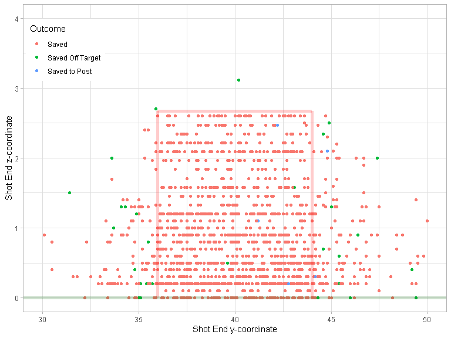

Miss It Like Messi
================

``` r
devtools::load_all()
#> i Loading shotmissr
```

## Table 1

``` r
statsbomb_shots_processed |>
  dplyr::group_by(League, Season) |>
  dplyr::summarise(num_shots = dplyr::n(), .groups = "keep")
#> # A tibble: 15 x 3
#> # Groups:   League, Season [15]
#>    League Season num_shots
#>    <fct>   <int>     <int>
#>  1 ARG      2019      3675
#>  2 FR2      2018      4405
#>  3 FR2      2019      3386
#>  4 FR2      2020      4243
#>  5 GR2      2018      4065
#>  6 GR2      2019      4189
#>  7 GR2      2020      3787
#>  8 MLS      2018      5383
#>  9 MLS      2019      5811
#> 10 MLS      2020      4071
#> 11 NED      2018      4212
#> 12 NED      2019      3235
#> 13 NED      2020      3960
#> 14 USL      2019      2503
#> 15 USL      2020      3551
```

## Figure 1

``` r
statsbomb_shots_processed |>
  dplyr::filter(League == "MLS", Season == 2018) |>
  dplyr::filter(!is.na(z_end)) |>
  ggplot2::ggplot() +
  ggplot2::geom_point(mapping = ggplot2::aes(
    x = y_end,
    y = z_end,
    color = outcome)) +
  plot_goalposts(color = "red", cex = 2, alpha = 0.2) +
  ggplot2::theme_bw()
```

<!-- -->

## Figure 2

``` r
statsbomb_shots_processed |>
  dplyr::filter(League == "USL", Season == 2020) |>
  dplyr::filter(!is.na(z_end)) |>
  dplyr::filter(grepl("Saved", outcome)) |>
  ggplot2::ggplot() +
  ggplot2::geom_point(mapping = ggplot2::aes(
    x = y_end,
    y = z_end,
    color = outcome)) +
  plot_goalposts(color = "red", cex = 2, alpha = 0.2) +
  ggplot2::theme_bw()
```

<!-- -->

``` r

statsbomb_shots_processed |>
  dplyr::filter(League == "USL", Season == 2020) |>
  dplyr::filter(!is.na(z_end)) |>
  dplyr::filter(grepl("Saved", outcome)) |>
  ggplot2::ggplot() +
  ggplot2::geom_point(mapping = ggplot2::aes(
    x = y_end_proj,
    y = z_end_proj,
    color = outcome)) +
  plot_goalposts(color = "red", cex = 2, alpha = 0.2) +
  ggplot2::theme_bw()
```

<!-- -->

## Figure 5

``` r
yy <- seq(y_left_post(), y_right_post(), by = 0.1)
zz <- seq(0, z_crossbar(), by = 0.03)
shots <- expand.grid(y = yy, z = zz)
shots |>
  dplyr::mutate(post_shot_xg = predict_post_xg(y, z)) |>
  ggplot2::ggplot() +
  ggplot2::geom_contour_filled(mapping = ggplot2::aes(
    x = y,
    y = z,
    z = post_shot_xg), bins = 100, show.legend = FALSE) +
  plot_goalposts(color = "red", cex = 2) +
  ggplot2::theme_bw()
```

<!-- -->

## Figure 7

``` r
statsbomb_shots |>
  dplyr::filter(League == "MLS", Season == 2018) |>
  dplyr::filter(!is.na(z_end)) |>
  ggplot2::ggplot() +
  ggplot2::geom_point(mapping = ggplot2::aes(
    x = y_end,
    y = z_end,
    color = outcome)) +
  plot_goalposts(color = "red", cex = 2, alpha = 0.2) +
  ggplot2::theme_bw()
```

<!-- -->

## Figure 8

``` r
z_target <- sort(unique(Hunter_et_al_2018_shots$target_height_yards))
cat("Execution error covariance matrices:")
#> Execution error covariance matrices:
get_execution_error_covariance(z_target[1])
#>           [,1]      [,2]
#> [1,] 0.7036574 0.1566326
#> [2,] 0.1566326 0.2969795
get_execution_error_covariance(z_target[2])
#>           [,1]      [,2]
#> [1,] 0.7815552 0.4417238
#> [2,] 0.4417238 0.7419683

yy = seq(34, 46, length.out = 100)
zz = seq(0, 4, length.out = 100)
yz = expand.grid(y = yy, z = zz)

gaussians <- yz |>
  dplyr::mutate(
    prob_low = tmvtnorm::dtmvnorm(
      x = as.matrix(yz),
      mean = c(y_center_line(), z_target[1]), 
      sigma = get_execution_error_covariance(z_target[1]), 
      lower = c(-Inf, 0)
    ),
    prob_high = tmvtnorm::dtmvnorm(
      x = as.matrix(yz),
      mean = c(y_center_line(), z_target[2]), 
      sigma = get_execution_error_covariance(z_target[2]), 
      lower = c(-Inf, 0)
    )
  )

Hunter_et_al_2018_shots |>
  # Get low-target shots
  dplyr:::filter(target_height_yards == z_target[1]) |>
  dplyr::mutate(
    y_end = y_center_line() + horizontal_error_yards,
    z_end = target_height_yards + vertical_error_yards
  ) |>
  ggplot2::ggplot() +
  # Add contour plot of Gaussian
  ggplot2::geom_contour_filled(
    data = gaussians,
    mapping = ggplot2::aes(x = y, y = z, z = prob_low),
    breaks = seq(0.01, 0.7, by = 0.07)
  ) +
  # Make Gaussian contour colour blue
  ggplot2::scale_fill_brewer() +
  # Add observed shots
  ggplot2::geom_point(
    mapping = ggplot2::aes(
      x = y_end,
      y = z_end), 
    colour = "orange", size = 0.5
  ) +
  # Add target location
  ggplot2::geom_point(x = y_center_line(), y = z_target[1], colour = "red") +
  plot_goalposts(color = "red", cex = 2, alpha = 0.2) +
  ggplot2::theme_bw()
```

<!-- -->

``` r

Hunter_et_al_2018_shots |>
  # Get high-target shots
  dplyr:::filter(target_height_yards == z_target[2]) |>
  dplyr::mutate(
    y_end = y_center_line() + horizontal_error_yards,
    z_end = target_height_yards + vertical_error_yards
  ) |>
  ggplot2::ggplot() +
  # Add contour plot of Gaussian
  ggplot2::geom_contour_filled(
    data = gaussians,
    mapping = ggplot2::aes(x = y, y = z, z = prob_high),
    breaks = seq(0.01, 0.3, by = 0.03)
  ) +
  # Make Gaussian contour colour blue
  ggplot2::scale_fill_brewer() +
  # Add observed shots
  ggplot2::geom_point(
    mapping = ggplot2::aes(
      x = y_end,
      y = z_end), 
    colour = "orange", size = 0.5
  ) +
  # Add target location
  ggplot2::geom_point(x = y_center_line(), y = z_target[2], colour = "red") +
  plot_goalposts(color = "red", cex = 2, alpha = 0.2) +
  ggplot2::theme_bw()
```

<!-- -->

## Pipeline to compute metrics

``` r
# Note: mixture_model_components and global_weights should already be filtered
pipeline <- function(
    shots_data,
    grouping_cols = c("player"),
    group_size_threshold = 30,
    mixture_model_components,
    global_weights,
    alpha = Inf
  ) {
  shooting_skill_data <- shots_data |>
    dplyr::group_by(dplyr::across(dplyr::all_of(grouping_cols))) |>
    dplyr::filter(dplyr::n() >= group_size_threshold) |>
    dplyr::mutate(group_id = dplyr::cur_group_id()) |>
    dplyr::ungroup()
  
  if (nrow(shooting_skill_data) == 0) {
    print("Could not run pipeline. No groups meet sample size threshold.")
  }
  
  shots <- as.matrix(shooting_skill_data |> dplyr::select(y_end_proj, z_end_proj))
  
  pdfs <- get_shot_probability_densities(
    mixture_model_components,
    shots
  )
  
  player_weights <- fit_player_weights(
    pdfs,
    shooting_skill_data$group_id,
    global_weights,
    alpha = alpha
  )
  
  shooting_skill_data |>
    load_rb_post_xg(player_weights, mixture_model_components) |>
    load_gen_post_xg(pdfs, mixture_model_components)
}

shots_data <- statsbomb_shots_processed |>
  dplyr::filter(!is.na(z_end_proj)) |>
  dplyr::group_by(player, Season) |>
  dplyr::filter(dplyr::n() >= 50) |>
  dplyr::ungroup()

mixture_model_components <- get_mixture_model_components() |>
  get_component_values()

pdfs <- get_shot_probability_densities(
  mixture_model_components,
  shots = shots_data |>
    dplyr::select(y_end_proj, z_end_proj) |>
    as.matrix()
)
global_weights <- fit_global_weights(pdfs)
selected_components <- which(global_weights > 0.012)

metrics <- pipeline(
  shots_data = shots_data,
  group_size_threshold = 10,
  mixture_model_components = mixture_model_components[selected_components,],
  global_weights = global_weights[selected_components]
)
```

## Interseason stability

``` r
season_stats <- metrics |>
  dplyr::group_by(player, Season) |>
  dplyr::summarise(
    dplyr::across(dplyr::matches("xg|xG"), mean, na.rm = TRUE),
    .groups = "keep"
  )

season_stats |>
  dplyr::inner_join(season_stats, by = c("player"), suffix = c("_a", "_b")) |>
  dplyr::filter(Season_a + 1 == Season_b) |>
  dplyr::ungroup() |>
  # Get metrics only
  dplyr::select(dplyr::matches("xg|Xg")) |>
  # Get correlation matrix
  cor() |>
  # Subset correlation matrix so season A is rows and season B is columns
  data.frame() |>
  dplyr::select(dplyr::ends_with("_a")) |>
  t() |>
  data.frame() |>
  dplyr::select(dplyr::ends_with("_b")) |>
  as.matrix()
#>               SBPreXg_b SBPostXg_b rb_post_xg_b gen_post_xg_b
#> SBPreXg_a            NA         NA           NA            NA
#> SBPostXg_a           NA         NA           NA            NA
#> rb_post_xg_a         NA         NA           NA            NA
#> gen_post_xg_a        NA         NA           NA            NA
```
