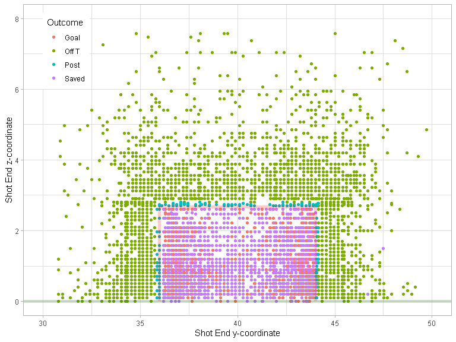

Miss It Like Messi
================

``` r
devtools::load_all()
#> i Loading shotmissr
```

## Table 1

``` r
statsbomb_shots_processed |>
  dplyr::group_by(League, Season) |>
  dplyr::summarise(num_shots = dplyr::n(), .groups = "keep") |>
  knitr::kable()
```

| League | Season | num_shots |
|:-------|-------:|----------:|
| ARG    |   2019 |      2075 |
| FR2    |   2018 |      2598 |
| FR2    |   2019 |      1995 |
| FR2    |   2020 |      2489 |
| GR2    |   2018 |      2273 |
| GR2    |   2019 |      2382 |
| GR2    |   2020 |      2140 |
| MLS    |   2018 |      3261 |
| MLS    |   2019 |      3555 |
| MLS    |   2020 |      2391 |
| NED    |   2018 |      2515 |
| NED    |   2019 |      1934 |
| NED    |   2020 |      2360 |
| USL    |   2019 |      1523 |
| USL    |   2020 |      2119 |

## Figure 1

``` r
statsbomb_shots_processed |>
  dplyr::filter(League == "MLS", Season == 2018) |>
  dplyr::filter(!is.na(z_end)) |>
  dplyr::rename(Outcome = outcome) |>
  ggplot2::ggplot() +
  ggplot2::geom_point(mapping = ggplot2::aes(
    x = y_end,
    y = z_end,
    color = Outcome)) +
  plot_goalposts(color = "red", cex = 2, alpha = 0.2) +
  plot_grass(color = "darkgreen", cex = 2, alpha = 0.2) +
  ggplot2::theme_light() +
  ggplot2::xlim(30, 50) +
  ggplot2::ylim(0, 8) +
  ggplot2::labs(
    x = "Shot End y-coordinate",
    y = "Shot End z-coordinate"
  ) +
  ggplot2::theme(legend.position = c(0.1, 0.85))
```

<!-- -->

## Figure 2

``` r
statsbomb_shots_processed |>
  dplyr::filter(League == "USL", Season == 2020) |>
  dplyr::filter(!is.na(z_end)) |>
  dplyr::filter(grepl("Saved", outcome)) |>
  dplyr::rename(Outcome = outcome) |>
  ggplot2::ggplot() +
  ggplot2::geom_point(mapping = ggplot2::aes(
    x = y_end,
    y = z_end,
    color = Outcome)) +
  plot_goalposts(color = "red", cex = 2, alpha = 0.2) +
  plot_grass(color = "darkgreen", cex = 2, alpha = 0.2) +
  ggplot2::theme_light() +
  ggplot2::xlim(30, 50) +
  ggplot2::ylim(0, 3) +
  ggplot2::labs(
    x = "Shot End y-coordinate",
    y = "Shot End z-coordinate"
  ) +
  ggplot2::theme(legend.position = c(0.1, 0.85))
#> Warning: Removed 2 rows containing missing values (geom_point).
```

<!-- -->

``` r

statsbomb_shots_processed |>
  dplyr::filter(League == "USL", Season == 2020) |>
  dplyr::filter(!is.na(z_end)) |>
  dplyr::filter(grepl("Saved", outcome)) |>
  dplyr::rename(Outcome = outcome) |>
  ggplot2::ggplot() +
  ggplot2::geom_point(mapping = ggplot2::aes(
    x = y_end_proj,
    y = z_end_proj,
    color = Outcome)) +
  plot_goalposts(color = "red", cex = 2, alpha = 0.2) +
  plot_grass(color = "darkgreen", cex = 2, alpha = 0.2) +
  ggplot2::theme_light() +
  ggplot2::xlim(30, 50) +
  ggplot2::ylim(0, 3) +
  ggplot2::labs(
    x = "Shot End y-coordinate",
    y = "Shot End z-coordinate"
  ) +
  ggplot2::theme(legend.position = c(0.1, 0.85))
#> Warning: Removed 1 rows containing missing values (geom_point).
```

<!-- -->

## Figure 5

``` r
yy <- seq(y_left_post(), y_right_post(), by = 0.1)
zz <- seq(0, z_crossbar(), by = 0.03)
shots <- expand.grid(y = yy, z = zz)
shots |>
  dplyr::mutate(post_shot_xg = predict_post_xg(y, z)) |>
  ggplot2::ggplot() +
  ggplot2::geom_contour_filled(
    mapping = ggplot2::aes(x = y, y = z, z = post_shot_xg),
    bins = 100,
    show.legend = FALSE
  ) +
  plot_goalposts(color = "red", cex = 2) +
  plot_grass(color = "darkgreen", cex = 2) +
  ggplot2::theme_light() +
  ggplot2::xlim(35, 45) +
  ggplot2::ylim(0, 3) +
  ggplot2::labs(
    x = "Shot End y-coordinate",
    y = "Shot End z-coordinate"
  )
```

<!-- -->

## Figure 7

``` r
statsbomb_shots |>
  dplyr::filter(League == "MLS", Season == 2018) |>
  dplyr::filter(!is.na(z_end)) |>
  dplyr::rename(Outcome = outcome) |>
  ggplot2::ggplot() +
  ggplot2::geom_point(mapping = ggplot2::aes(
    x = y_end,
    y = z_end,
    color = Outcome)) +
  plot_goalposts(color = "red", cex = 2, alpha = 0.2) +
  plot_grass(color = "darkgreen", cex = 2, alpha = 0.2) +
  ggplot2::theme_light() +
  ggplot2::xlim(30, 50) +
  ggplot2::ylim(0, 8) +
  ggplot2::labs(
    x = "Shot End y-coordinate",
    y = "Shot End z-coordinate"
  ) +
  ggplot2::theme(legend.position = c(0.1, 0.85))
```

<!-- -->

## Figure 8

``` r
z_target <- sort(unique(Hunter_et_al_2018_shots$target_height_yards))
cat("Execution error covariance matrices:")
#> Execution error covariance matrices:
get_execution_error_covariance(z_target[1])
#>           [,1]      [,2]
#> [1,] 0.7036574 0.1566326
#> [2,] 0.1566326 0.2969795
get_execution_error_covariance(z_target[2])
#>           [,1]      [,2]
#> [1,] 0.7815552 0.4417238
#> [2,] 0.4417238 0.7419683

yy = seq(34, 46, length.out = 100)
zz = seq(0, 4, length.out = 100)
yz = expand.grid(y = yy, z = zz)

gaussians <- yz |>
  dplyr::mutate(
    prob_low = tmvtnorm::dtmvnorm(
      x = as.matrix(yz),
      mean = c(y_center_line(), z_target[1]), 
      sigma = get_execution_error_covariance(z_target[1]), 
      lower = c(-Inf, 0)
    ),
    prob_high = tmvtnorm::dtmvnorm(
      x = as.matrix(yz),
      mean = c(y_center_line(), z_target[2]), 
      sigma = get_execution_error_covariance(z_target[2]), 
      lower = c(-Inf, 0)
    )
  )

Hunter_et_al_2018_shots |>
  # Get low-target shots
  dplyr:::filter(target_height_yards == z_target[1]) |>
  dplyr::mutate(
    y_end = y_center_line() + horizontal_error_yards,
    z_end = target_height_yards + vertical_error_yards
  ) |>
  ggplot2::ggplot() +
  # Add contour plot of Gaussian
  ggplot2::geom_contour_filled(
    data = gaussians,
    mapping = ggplot2::aes(x = y, y = z, z = prob_low),
    breaks = seq(0.01, 0.7, by = 0.07),
    show.legend = FALSE
  ) +
  # Make Gaussian contour colour blue
  ggplot2::scale_fill_brewer() +
  # Add observed shots
  ggplot2::geom_point(
    mapping = ggplot2::aes(
      x = y_end,
      y = z_end), 
    colour = "orange", size = 0.5
  ) +
  # Add target location
  ggplot2::geom_point(x = y_center_line(), y = z_target[1], colour = "red") +
  plot_goalposts(color = "red", cex = 2, alpha = 0.2) +
  plot_grass(color = "darkgreen", cex = 2, alpha = 0.2) +
  ggplot2::theme_light() +
  ggplot2::xlim(35, 45) +
  ggplot2::ylim(0, 4.5) +
  ggplot2::labs(
    x = "Shot End y-coordinate",
    y = "Shot End z-coordinate"
  )
#> Warning: Removed 1800 rows containing non-finite values (stat_contour_filled).
#> Warning: Removed 1 rows containing missing values (geom_point).
```

<!-- -->

``` r

Hunter_et_al_2018_shots |>
  # Get high-target shots
  dplyr:::filter(target_height_yards == z_target[2]) |>
  dplyr::mutate(
    y_end = y_center_line() + horizontal_error_yards,
    z_end = target_height_yards + vertical_error_yards
  ) |>
  ggplot2::ggplot() +
  # Add contour plot of Gaussian
  ggplot2::geom_contour_filled(
    data = gaussians,
    mapping = ggplot2::aes(x = y, y = z, z = prob_high),
    breaks = seq(0.01, 0.3, by = 0.03),
    show.legend = FALSE
  ) +
  # Make Gaussian contour colour blue
  ggplot2::scale_fill_brewer() +
  # Add observed shots
  ggplot2::geom_point(
    mapping = ggplot2::aes(
      x = y_end,
      y = z_end), 
    colour = "orange", size = 0.5
  ) +
  # Add target location
  ggplot2::geom_point(x = y_center_line(), y = z_target[2], colour = "red") +
  plot_goalposts(color = "red", cex = 2, alpha = 0.2) +
  plot_grass(color = "darkgreen", cex = 2, alpha = 0.2) +
  ggplot2::theme_light() +
  ggplot2::xlim(35, 45) +
  ggplot2::ylim(0, 4.5) +
  ggplot2::labs(
    x = "Shot End y-coordinate",
    y = "Shot End z-coordinate"
  )
#> Warning: Removed 1800 rows containing non-finite values (stat_contour_filled).
#> Warning: Removed 5 rows containing missing values (geom_point).
```

<!-- -->

## Figure 3

``` r
mixture_model_components <- get_mixture_model_components()

yy = seq(34, 46, length.out = 100)
zz = seq(0, 4, length.out = 100)
yz = expand.grid(y = yy, z = zz)

# Get probability density for each shot/component
pdfs <- get_shot_probability_densities(
  mixture_model_components[selected_components,],
  as.matrix(yz)
)

# Normalize each column to put components on equal footing
pdfs <- apply(pdfs, 2, function(x) {x / max(x)})

mixture_model_pdfs <- yz |>
  dplyr::mutate(pdf = apply(pdfs, 1, max)) |>
  tibble::tibble()

mixture_model_components[selected_components,] |>
  dplyr::mutate(
    y = purrr::map_dbl(mean, ~.[[1]]),
    z = purrr::map_dbl(mean, ~.[[2]]),
    weight = global_weights,
    lambda = as.factor(lambda)
  ) |>
  dplyr::filter(weight > 0.012) |>
  dplyr::rename(Weight = weight) |>
  ggplot2::ggplot() +
  ggplot2::geom_point(
    mapping = ggplot2::aes(x = y, y = z, alpha = Weight, size = lambda),
    colour = "darkblue"
  ) +
  ggplot2::scale_size_manual(values = c(3, 7)) +
  plot_goalposts(color = "red", cex = 2, alpha = 0.2) +
  plot_grass(color = "darkgreen", cex = 2, alpha = 0.2) +
  ggplot2::theme_light() +
  ggplot2::xlim(35, 45) +
  ggplot2::ylim(0, 3) +
  ggplot2::labs(
    x = "Shot End y-coordinate",
    y = "Shot End z-coordinate"
  ) +
  # Add contour plot of Gaussians
  ggplot2::geom_contour_filled(
    data = mixture_model_pdfs,
    mapping = ggplot2::aes(x = y, y = z, z = pdf),
    bins = 9,
    alpha = 0.3,
    breaks = seq(0.7, 1, by = 0.1),
    show.legend = FALSE
  ) +
  # Make Gaussian contours coloured blue
  ggplot2::scale_fill_brewer()
#> Warning: Removed 3850 rows containing non-finite values (stat_contour_filled).
```

<!-- -->

## Calculate player metrics

``` r
half_season_stats <- shot_metrics |>
  dplyr::mutate(SBPostXg = ifelse(is.na(SBPostXg), 0, SBPostXg)) |>
  dplyr::mutate(goal_pct = (outcome == "Goal")) |>
  dplyr::mutate(
    gax = goal_pct - SBPreXg,
    ega = SBPostXg - SBPreXg
  ) |>
  dplyr::group_by(player, Season, first_half_season) |>
  dplyr::summarise(
    dplyr::across(dplyr::matches("goal_pct|gax|ega|_xg"), mean, na.rm = TRUE),
    n = dplyr::n(),
    .groups = "keep"
  )
```

## Table 3

``` r
stability_data <- half_season_stats |>
  dplyr::inner_join(half_season_stats, by = c("player", "Season"), suffix = c("_a", "_b")) |>
  dplyr::filter(first_half_season_a, !first_half_season_b) |>
  dplyr::ungroup()

stability_data |>
  # Get metrics only
  dplyr::select(
    dplyr::starts_with("goal_pct"),
    dplyr::starts_with("gax"),
    dplyr::starts_with("ega"),
    dplyr::matches("_xg")
  ) |>
  # Get correlation matrix
  cor() |>
  # Subset correlation matrix so season A is rows and season B is columns
  data.frame() |>
  dplyr::select(dplyr::ends_with("_a")) |>
  t() |>
  data.frame() |>
  dplyr::select(dplyr::ends_with("_b")) |>
  as.matrix() |>
  knitr::kable()
```

|               | goal_pct_b |     gax_b |      ega_b | rb_post_xg_b | gen_post_xg_b |
|:--------------|-----------:|----------:|-----------:|-------------:|--------------:|
| goal_pct_a    |  0.0193315 | 0.0176607 | -0.0025766 |   -0.0132630 |    -0.0020086 |
| gax_a         |  0.0095136 | 0.0121390 | -0.0150594 |   -0.0131651 |    -0.0003247 |
| ega_a         |  0.0075435 | 0.0027666 | -0.0088125 |   -0.0382934 |    -0.0335995 |
| rb_post_xg_a  |  0.0268301 | 0.0340300 | -0.0014224 |    0.0035993 |     0.0380098 |
| gen_post_xg_a |  0.0369969 | 0.0392833 | -0.0284008 |    0.0051541 |     0.0602029 |

## Table 4

``` r
stability_data |>
  dplyr::filter(n_a + n_b >= 30) |>
  # Get metrics only
  dplyr::select(
    dplyr::starts_with("gax"),
    dplyr::starts_with("ega"),
    dplyr::matches("_xg")
  ) |>
  # Get correlation matrix
  cor() |>
  # Subset correlation matrix so season A is rows and season B is columns
  data.frame() |>
  dplyr::select(dplyr::ends_with("_a")) |>
  t() |>
  data.frame() |>
  dplyr::select(dplyr::ends_with("_b")) |>
  as.matrix() |>
  knitr::kable()
```

|               |     gax_b |     ega_b | rb_post_xg_b | gen_post_xg_b |
|:--------------|----------:|----------:|-------------:|--------------:|
| gax_a         | 0.0925974 | 0.0841096 |    0.0421375 |     0.0455160 |
| ega_a         | 0.0655735 | 0.0874220 |   -0.0586405 |    -0.0843918 |
| rb_post_xg_a  | 0.0866264 | 0.0034200 |    0.0265307 |     0.0928450 |
| gen_post_xg_a | 0.1314014 | 0.1204237 |    0.0630395 |     0.1057084 |

``` r
stability_data |>
  dplyr::filter(n_a + n_b >= 5)
#> # A tibble: 998 x 16
#>    player  Season first~1 rb_po~2 gen_p~3 goal_~4   gax_a    ega_a   n_a first~5
#>    <fct>    <int> <lgl>     <dbl>   <dbl>   <dbl>   <dbl>    <dbl> <int> <lgl>  
#>  1 Aaron ~   2019 TRUE     0.0783  0.0811  0      -0.0400  0.0739      7 FALSE  
#>  2 Aaron ~   2020 TRUE     0.0795  0.0869  0      -0.0381 -0.0181      7 FALSE  
#>  3 Abdena~   2018 TRUE     0.0790  0.0831  0.0667  0.0297  0.0536     15 FALSE  
#>  4 Abdena~   2020 TRUE     0.0792  0.0916  0      -0.0195 -0.00149     5 FALSE  
#>  5 Abdoul~   2019 TRUE     0.0802  0.0911  0.2     0.173   0.0733      5 FALSE  
#>  6 Abdoul~   2019 TRUE     0.0733  0.0677  0      -0.0318  0.0228     11 FALSE  
#>  7 Abdoul~   2020 TRUE     0.0775  0.0776  0.111   0.0806  0.0155     18 FALSE  
#>  8 Abouba~   2018 TRUE     0.0787  0.0818  0      -0.0458 -0.0286      6 FALSE  
#>  9 Adam B~   2020 TRUE     0.0777  0.0719  0      -0.0344  0.0221      6 FALSE  
#> 10 Adam M~   2019 TRUE     0.0776  0.0792  0      -0.0303 -0.0132      7 FALSE  
#> # ... with 988 more rows, 6 more variables: rb_post_xg_b <dbl>,
#> #   gen_post_xg_b <dbl>, goal_pct_b <dbl>, gax_b <dbl>, ega_b <dbl>, n_b <int>,
#> #   and abbreviated variable names 1: first_half_season_a, 2: rb_post_xg_a,
#> #   3: gen_post_xg_a, 4: goal_pct_a, 5: first_half_season_b
```

## Figure 6

``` r
get_stability_above_threshold <- function(metric, n) {
  filtered_data <- stability_data |>
    dplyr::filter(n_a + n_b >= n)
  
  # TODO bootstrap rows here to get estimate of lower and upper bound
  
  cor(filtered_data[[paste0(metric, "_a")]], filtered_data[[paste0(metric, "_b")]])
}

expand.grid(threshold = 6:60, metric = c("gax", "ega", "rb_post_xg", "gen_post_xg")) |>
  dplyr::mutate(
    stability = purrr::map2_dbl(threshold, metric, ~ get_stability_above_threshold(.y, .x))
  ) |>
  dplyr::mutate(
    metric = dplyr::case_when(
      metric == "gax" ~ "GAX",
      metric == "ega" ~ "EGA",
      metric == "rb_post_xg" ~ "RBPostXg",
      metric == "gen_post_xg" ~ "GenPostXg"
    )
  ) |>
  dplyr::rename(
    Metric = metric
  ) |>
  dplyr::filter(threshold <= 50) |>
  ggplot2::ggplot(ggplot2::aes(x = threshold, y= stability, colour = Metric)) +
  ggplot2::geom_line() +
  ggplot2::theme_light() +
  ggplot2::labs(
    x = "Minimum Sample Size",
    y = "Correlation"
  ) +
  ggplot2::theme(legend.position = c(0.1, 0.85))
```

<!-- -->

``` r
# TODO Use geom_ribbon here to add custom error bars returned by get_stability_above_threshold
```
