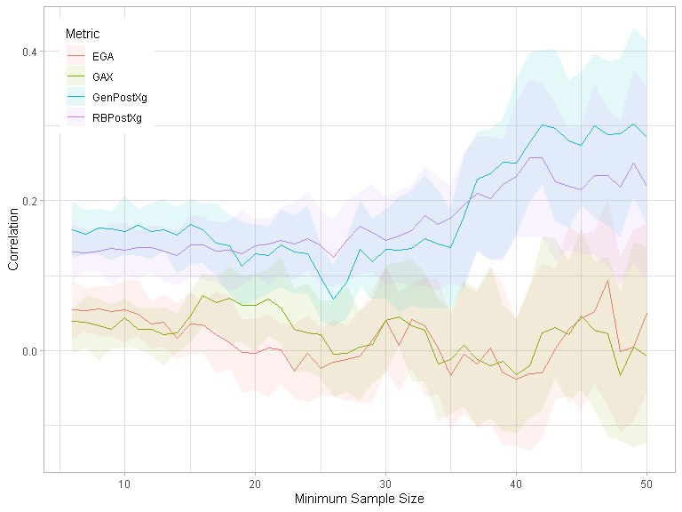

Miss It Like Messi
================

``` r
devtools::load_all()
#> i Loading shotmissr
```

## Table 1

``` r
statsbomb_shots_processed |>
  dplyr::group_by(League, Season) |>
  dplyr::summarise(num_shots = dplyr::n(), .groups = "keep") |>
  knitr::kable()
```

| League | Season | num_shots |
|:-------|-------:|----------:|
| ARG    |   2019 |      3409 |
| FR2    |   2018 |      4438 |
| FR2    |   2019 |      3290 |
| FR2    |   2020 |      4300 |
| GR2    |   2018 |      4086 |
| GR2    |   2019 |      4099 |
| GR2    |   2020 |      3881 |
| MLS    |   2018 |      5857 |
| MLS    |   2019 |      6220 |
| MLS    |   2020 |      4294 |
| NED    |   2018 |      4571 |
| NED    |   2019 |      3384 |
| NED    |   2020 |      4198 |
| USL    |   2019 |      2677 |
| USL    |   2020 |      3823 |

## Figure 1

``` r
statsbomb_shots_processed |>
  dplyr::filter(League == "MLS", Season == 2018) |>
  dplyr::filter(!is.na(z_end)) |>
  dplyr::rename(Outcome = outcome) |>
  ggplot2::ggplot() +
  ggplot2::geom_point(mapping = ggplot2::aes(
    x = y_end,
    y = z_end,
    color = Outcome)) +
  plot_goalposts(color = "red", cex = 2, alpha = 0.2) +
  plot_grass(color = "darkgreen", cex = 2, alpha = 0.2) +
  ggplot2::theme_light() +
  ggplot2::xlim(30, 50) +
  ggplot2::ylim(0, 8) +
  ggplot2::labs(
    x = "Shot End y-coordinate",
    y = "Shot End z-coordinate"
  ) +
  ggplot2::theme(legend.position = c(0.1, 0.85))
```

<!-- -->

## Figure 2

``` r
statsbomb_shots_processed |>
  dplyr::filter(League == "USL", Season == 2020) |>
  dplyr::filter(!is.na(z_end)) |>
  dplyr::filter(grepl("Saved", outcome)) |>
  dplyr::rename(Outcome = outcome) |>
  ggplot2::ggplot() +
  ggplot2::geom_point(mapping = ggplot2::aes(
    x = y_end,
    y = z_end,
    color = Outcome)) +
  plot_goalposts(color = "red", cex = 2, alpha = 0.2) +
  plot_grass(color = "darkgreen", cex = 2, alpha = 0.2) +
  ggplot2::theme_light() +
  ggplot2::xlim(30, 50) +
  ggplot2::ylim(0, 3) +
  ggplot2::labs(
    x = "Shot End y-coordinate",
    y = "Shot End z-coordinate"
  ) +
  ggplot2::theme(legend.position = c(0.1, 0.85))
#> Warning: Removed 13 rows containing missing values (geom_point).
```

<!-- -->

``` r

statsbomb_shots_processed |>
  dplyr::filter(League == "USL", Season == 2020) |>
  dplyr::filter(!is.na(z_end)) |>
  dplyr::filter(grepl("Saved", outcome)) |>
  dplyr::rename(Outcome = outcome) |>
  ggplot2::ggplot() +
  ggplot2::geom_point(mapping = ggplot2::aes(
    x = y_end_proj,
    y = z_end_proj,
    color = Outcome)) +
  plot_goalposts(color = "red", cex = 2, alpha = 0.2) +
  plot_grass(color = "darkgreen", cex = 2, alpha = 0.2) +
  ggplot2::theme_light() +
  ggplot2::xlim(30, 50) +
  ggplot2::ylim(0, 3) +
  ggplot2::labs(
    x = "Shot End y-coordinate",
    y = "Shot End z-coordinate"
  ) +
  ggplot2::theme(legend.position = c(0.1, 0.85))
#> Warning: Removed 2 rows containing missing values (geom_point).
```

<!-- -->

## Figure 5

``` r
yy <- seq(y_left_post(), y_right_post(), by = 0.1)
zz <- seq(0, z_crossbar(), by = 0.03)
shots <- expand.grid(y = yy, z = zz)
shots |>
  dplyr::mutate(post_shot_xg = predict_post_xg(y, z)) |>
  ggplot2::ggplot() +
  ggplot2::geom_contour_filled(
    mapping = ggplot2::aes(x = y, y = z, z = post_shot_xg),
    bins = 100,
    show.legend = FALSE
  ) +
  plot_goalposts(color = "red", cex = 2) +
  plot_grass(color = "darkgreen", cex = 2) +
  ggplot2::theme_light() +
  ggplot2::xlim(35, 45) +
  ggplot2::ylim(0, 3) +
  ggplot2::labs(
    x = "Shot End y-coordinate",
    y = "Shot End z-coordinate"
  )
```

<!-- -->

## Figure 7

``` r
statsbomb_shots |>
  dplyr::filter(League == "MLS", Season == 2018) |>
  dplyr::filter(!is.na(z_end)) |>
  dplyr::rename(Outcome = outcome) |>
  ggplot2::ggplot() +
  ggplot2::geom_point(mapping = ggplot2::aes(
    x = y_end,
    y = z_end,
    color = Outcome)) +
  plot_goalposts(color = "red", cex = 2, alpha = 0.2) +
  plot_grass(color = "darkgreen", cex = 2, alpha = 0.2) +
  ggplot2::theme_light() +
  ggplot2::xlim(30, 50) +
  ggplot2::ylim(0, 8) +
  ggplot2::labs(
    x = "Shot End y-coordinate",
    y = "Shot End z-coordinate"
  ) +
  ggplot2::theme(legend.position = c(0.1, 0.85))
```

<!-- -->

## Figure 8

``` r
z_target <- sort(unique(Hunter_et_al_2018_shots$target_height_yards))
cat("Execution error covariance matrices:")
#> Execution error covariance matrices:
get_execution_error_covariance(z_target[1])
#>           [,1]      [,2]
#> [1,] 0.7036574 0.1566326
#> [2,] 0.1566326 0.2969795
get_execution_error_covariance(z_target[2])
#>           [,1]      [,2]
#> [1,] 0.7815552 0.4417238
#> [2,] 0.4417238 0.7419683

yy = seq(34, 46, length.out = 100)
zz = seq(0, 4, length.out = 100)
yz = expand.grid(y = yy, z = zz)

gaussians <- yz |>
  dplyr::mutate(
    prob_low = tmvtnorm::dtmvnorm(
      x = as.matrix(yz),
      mean = c(y_center_line(), z_target[1]), 
      sigma = get_execution_error_covariance(z_target[1]), 
      lower = c(-Inf, 0)
    ),
    prob_high = tmvtnorm::dtmvnorm(
      x = as.matrix(yz),
      mean = c(y_center_line(), z_target[2]), 
      sigma = get_execution_error_covariance(z_target[2]), 
      lower = c(-Inf, 0)
    )
  )

Hunter_et_al_2018_shots |>
  # Get low-target shots
  dplyr:::filter(target_height_yards == z_target[1]) |>
  dplyr::mutate(
    y_end = y_center_line() + horizontal_error_yards,
    z_end = target_height_yards + vertical_error_yards
  ) |>
  ggplot2::ggplot() +
  # Add contour plot of Gaussian
  ggplot2::geom_contour_filled(
    data = gaussians,
    mapping = ggplot2::aes(x = y, y = z, z = prob_low),
    breaks = seq(0.01, 0.7, by = 0.07),
    show.legend = FALSE
  ) +
  # Make Gaussian contour colour blue
  ggplot2::scale_fill_brewer() +
  # Add observed shots
  ggplot2::geom_point(
    mapping = ggplot2::aes(
      x = y_end,
      y = z_end), 
    colour = "orange", size = 0.5
  ) +
  # Add target location
  ggplot2::geom_point(x = y_center_line(), y = z_target[1], colour = "red") +
  plot_goalposts(color = "red", cex = 2, alpha = 0.2) +
  plot_grass(color = "darkgreen", cex = 2, alpha = 0.2) +
  ggplot2::theme_light() +
  ggplot2::xlim(35, 45) +
  ggplot2::ylim(0, 4.5) +
  ggplot2::labs(
    x = "Shot End y-coordinate",
    y = "Shot End z-coordinate"
  )
#> Warning: Removed 1800 rows containing non-finite values (stat_contour_filled).
#> Warning: Removed 1 rows containing missing values (geom_point).
```

<!-- -->

``` r

Hunter_et_al_2018_shots |>
  # Get high-target shots
  dplyr:::filter(target_height_yards == z_target[2]) |>
  dplyr::mutate(
    y_end = y_center_line() + horizontal_error_yards,
    z_end = target_height_yards + vertical_error_yards
  ) |>
  ggplot2::ggplot() +
  # Add contour plot of Gaussian
  ggplot2::geom_contour_filled(
    data = gaussians,
    mapping = ggplot2::aes(x = y, y = z, z = prob_high),
    breaks = seq(0.01, 0.3, by = 0.03),
    show.legend = FALSE
  ) +
  # Make Gaussian contour colour blue
  ggplot2::scale_fill_brewer() +
  # Add observed shots
  ggplot2::geom_point(
    mapping = ggplot2::aes(
      x = y_end,
      y = z_end), 
    colour = "orange", size = 0.5
  ) +
  # Add target location
  ggplot2::geom_point(x = y_center_line(), y = z_target[2], colour = "red") +
  plot_goalposts(color = "red", cex = 2, alpha = 0.2) +
  plot_grass(color = "darkgreen", cex = 2, alpha = 0.2) +
  ggplot2::theme_light() +
  ggplot2::xlim(35, 45) +
  ggplot2::ylim(0, 4.5) +
  ggplot2::labs(
    x = "Shot End y-coordinate",
    y = "Shot End z-coordinate"
  )
#> Warning: Removed 1800 rows containing non-finite values (stat_contour_filled).
#> Warning: Removed 5 rows containing missing values (geom_point).
```

<!-- -->

## Figure 3

``` r
mixture_model_components <- get_mixture_model_components()

mixture_model_components[selected_components,] |>
  dplyr::mutate(
    y = purrr::map_dbl(mean, ~.[[1]]),
    z = purrr::map_dbl(mean, ~.[[2]]),
    weight = global_weights,
    lambda = as.factor(lambda)
  ) |>
  dplyr::filter(weight > 0.012) |>
  dplyr::rename(Weight = weight) |>
  ggplot2::ggplot(ggplot2::aes(x = y, y = z, alpha = Weight, size = lambda)) +
  ggplot2::geom_point(colour = "blue") +
  ggplot2::scale_size_manual(values = c(3, 7)) +
  plot_goalposts(color = "red", cex = 2, alpha = 0.2) +
  plot_grass(color = "darkgreen", cex = 2, alpha = 0.2) +
  ggplot2::theme_light() +
  ggplot2::xlim(35, 45) +
  ggplot2::ylim(0, 3) +
  ggplot2::labs(
    x = "Shot End y-coordinate",
    y = "Shot End z-coordinate"
  )
```

<!-- -->

## Calculate player metrics

``` r
half_season_stats <- shot_metrics |>
  dplyr::mutate(SBPostXg = ifelse(is.na(SBPostXg), 0, SBPostXg)) |>
  dplyr::mutate(goal_pct = (outcome == "Goal")) |>
  dplyr::mutate(
    gax = goal_pct - SBPreXg,
    ega = SBPostXg - SBPreXg
  ) |>
  dplyr::group_by(player, Season, first_half_season) |>
  dplyr::summarise(
    dplyr::across(dplyr::matches("goal_pct|gax|ega|_xg"), mean, na.rm = TRUE),
    n = dplyr::n(),
    .groups = "keep"
  )
```

## Table 3

``` r
stability_data <- half_season_stats |>
  dplyr::inner_join(half_season_stats, by = c("player", "Season"), suffix = c("_a", "_b")) |>
  dplyr::filter(first_half_season_a, !first_half_season_b) |>
  dplyr::ungroup()

stability_data |>
  # Get metrics only
  dplyr::select(
    dplyr::starts_with("goal_pct"),
    dplyr::starts_with("gax"),
    dplyr::starts_with("ega"),
    dplyr::matches("_xg")
  ) |>
  # Get correlation matrix
  cor() |>
  # Subset correlation matrix so season A is rows and season B is columns
  data.frame() |>
  dplyr::select(dplyr::ends_with("_a")) |>
  t() |>
  data.frame() |>
  dplyr::select(dplyr::ends_with("_b")) |>
  as.matrix() |>
  knitr::kable()
```

|               | goal_pct_b |     gax_b |     ega_b | rb_post_xg_b | gen_post_xg_b |
|:--------------|-----------:|----------:|----------:|-------------:|--------------:|
| goal_pct_a    |  0.2027644 | 0.0358458 | 0.0383046 |    0.1228743 |     0.1638671 |
| gax_a         |  0.0439170 | 0.0353784 | 0.0249364 |    0.0127014 |     0.0349669 |
| ega_a         |  0.0202310 | 0.0052795 | 0.0359962 |    0.0131409 |     0.0442071 |
| rb_post_xg_a  |  0.1489195 | 0.0172616 | 0.0209663 |    0.1992753 |     0.1924053 |
| gen_post_xg_a |  0.1648546 | 0.0224296 | 0.0422315 |    0.1943594 |     0.2267084 |

## Table 4

``` r
stability_data |>
  dplyr::filter(n_a + n_b >= 30) |>
  # Get metrics only
  dplyr::select(
    dplyr::starts_with("goal_pct"),
    dplyr::starts_with("gax"),
    dplyr::starts_with("ega"),
    dplyr::matches("_xg")
  ) |>
  # Get correlation matrix
  cor() |>
  # Subset correlation matrix so season A is rows and season B is columns
  data.frame() |>
  dplyr::select(dplyr::ends_with("_a")) |>
  t() |>
  data.frame() |>
  dplyr::select(dplyr::ends_with("_b")) |>
  as.matrix() |>
  knitr::kable()
```

|               | goal_pct_b |     gax_b |     ega_b | rb_post_xg_b | gen_post_xg_b |
|:--------------|-----------:|----------:|----------:|-------------:|--------------:|
| goal_pct_a    |  0.2860967 | 0.0409510 | 0.0257428 |    0.1449043 |     0.1456253 |
| gax_a         |  0.0373490 | 0.0514288 | 0.0195463 |   -0.0458517 |    -0.0546989 |
| ega_a         |  0.0019526 | 0.0365588 | 0.0183749 |   -0.0395099 |    -0.0310349 |
| rb_post_xg_a  |  0.2164462 | 0.0481730 | 0.0255283 |    0.2333471 |     0.2565853 |
| gen_post_xg_a |  0.2214890 | 0.0442887 | 0.0190876 |    0.2436387 |     0.2793804 |

``` r
stability_data |>
  dplyr::filter(n_a + n_b >= 50)
#> # A tibble: 75 x 16
#>    player Season first~1 rb_po~2 gen_p~3 goal_~4    gax_a    ega_a   n_a first~5
#>    <fct>   <int> <lgl>     <dbl>   <dbl>   <dbl>    <dbl>    <dbl> <int> <lgl>  
#>  1 Aleks~   2018 TRUE      0.143   0.140  0.192   0.0882   0.0334     26 FALSE  
#>  2 Aleks~   2019 TRUE      0.134   0.126  0.0938  0.0423   0.0199     32 FALSE  
#>  3 Alexa~   2019 TRUE      0.153   0.154  0.16    0.0592   0.0500     25 FALSE  
#>  4 Andre~   2018 TRUE      0.160   0.169  0.167   0.0104   0.0360     24 FALSE  
#>  5 Arthu~   2018 TRUE      0.140   0.140  0.16   -0.00140  0.0335     25 FALSE  
#>  6 Bradl~   2018 TRUE      0.137   0.136  0.269   0.0913   0.0676     26 FALSE  
#>  7 Brani~   2020 TRUE      0.135   0.130  0.133  -0.0304  -0.00890    30 FALSE  
#>  8 Bryan~   2018 TRUE      0.137   0.126  0.08   -0.0276  -0.00542    25 FALSE  
#>  9 Carlo~   2018 TRUE      0.142   0.134  0.111   0.0491   0.0122     27 FALSE  
#> 10 Carlo~   2019 TRUE      0.138   0.133  0.311   0.157    0.0655     45 FALSE  
#> # ... with 65 more rows, 6 more variables: rb_post_xg_b <dbl>,
#> #   gen_post_xg_b <dbl>, goal_pct_b <dbl>, gax_b <dbl>, ega_b <dbl>, n_b <int>,
#> #   and abbreviated variable names 1: first_half_season_a, 2: rb_post_xg_a,
#> #   3: gen_post_xg_a, 4: goal_pct_a, 5: first_half_season_b
```

## Figure 6

``` r
get_stability_above_threshold <- function(metric, n) {
  filtered_data <- stability_data |>
    dplyr::filter(n_a + n_b >= n)
  
  # TODO bootstrap rows here to get estimate of lower and upper bound
  
  cor(filtered_data[[paste0(metric, "_a")]], filtered_data[[paste0(metric, "_b")]])
}

expand.grid(threshold = 6:60, metric = c("gax", "ega", "rb_post_xg", "gen_post_xg")) |>
  dplyr::mutate(
    stability = purrr::map2_dbl(threshold, metric, ~ get_stability_above_threshold(.y, .x))
  ) |>
  ggplot2::ggplot(ggplot2::aes(x = threshold, y= stability, colour = metric)) +
  ggplot2::geom_line() +
  ggplot2::theme_light()
```

<!-- -->

``` r
# TODO Use geom_ribbon here to add custom error bars returned by get_stability_above_threshold
```
