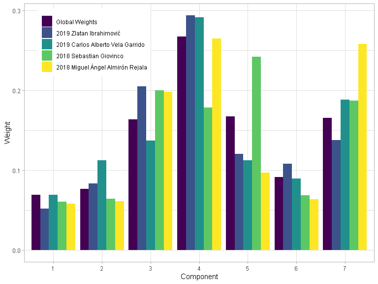

Miss It Like Messi
================

``` r
devtools::load_all()
#> i Loading shotmissr
```

## Table 1

``` r
statsbomb_shots_processed |>
  dplyr::group_by(League, Season) |>
  dplyr::summarise(num_shots = dplyr::n(), .groups = "keep") |>
  knitr::kable()
```

| League | Season | num_shots |
|:-------|-------:|----------:|
| ARG    |   2019 |      4425 |
| FR2    |   2018 |      5534 |
| FR2    |   2019 |      4190 |
| FR2    |   2020 |      5457 |
| GR2    |   2018 |      5123 |
| GR2    |   2019 |      5213 |
| GR2    |   2020 |      4934 |
| MLS    |   2018 |      7056 |
| MLS    |   2019 |      7435 |
| MLS    |   2020 |      5297 |
| NED    |   2018 |      5586 |
| NED    |   2019 |      4102 |
| NED    |   2020 |      5060 |
| USL    |   2019 |      3273 |
| USL    |   2020 |      4630 |

## Figure 1

``` r
statsbomb_shots_processed |>
  dplyr::filter(League == "MLS", Season == 2018) |>
  dplyr::filter(!is.na(z_end)) |>
  dplyr::rename(Outcome = outcome) |>
  ggplot2::ggplot() +
  ggplot2::geom_point(mapping = ggplot2::aes(
    x = y_end,
    y = z_end,
    color = Outcome)) +
  plot_goalposts(color = "red", cex = 2, alpha = 0.2) +
  plot_grass(color = "darkgreen", cex = 2, alpha = 0.2) +
  ggplot2::theme_light() +
  ggplot2::xlim(30, 50) +
  ggplot2::ylim(0, 8) +
  ggplot2::labs(
    x = "Shot End y-coordinate",
    y = "Shot End z-coordinate"
  ) +
  ggplot2::theme(legend.position = c(0.1, 0.85))
```

<!-- -->

## Figure 2

``` r
statsbomb_shots_processed |>
  dplyr::filter(League == "USL", Season == 2020) |>
  dplyr::filter(!is.na(z_end)) |>
  dplyr::filter(grepl("Saved", outcome)) |>
  dplyr::rename(Outcome = outcome) |>
  ggplot2::ggplot() +
  ggplot2::geom_point(mapping = ggplot2::aes(
    x = y_end,
    y = z_end,
    color = Outcome)) +
  plot_goalposts(color = "red", cex = 2, alpha = 0.2) +
  plot_grass(color = "darkgreen", cex = 2, alpha = 0.2) +
  ggplot2::theme_light() +
  ggplot2::xlim(30, 50) +
  ggplot2::ylim(0, 3) +
  ggplot2::labs(
    x = "Shot End y-coordinate",
    y = "Shot End z-coordinate"
  ) +
  ggplot2::theme(legend.position = c(0.1, 0.85))
#> Warning: Removed 13 rows containing missing values (geom_point).
```

<!-- -->

``` r

statsbomb_shots_processed |>
  dplyr::filter(League == "USL", Season == 2020) |>
  dplyr::filter(!is.na(z_end)) |>
  dplyr::filter(grepl("Saved", outcome)) |>
  dplyr::rename(Outcome = outcome) |>
  ggplot2::ggplot() +
  ggplot2::geom_point(mapping = ggplot2::aes(
    x = y_end_proj,
    y = z_end_proj,
    color = Outcome)) +
  plot_goalposts(color = "red", cex = 2, alpha = 0.2) +
  plot_grass(color = "darkgreen", cex = 2, alpha = 0.2) +
  ggplot2::theme_light() +
  ggplot2::xlim(30, 50) +
  ggplot2::ylim(0, 3) +
  ggplot2::labs(
    x = "Shot End y-coordinate",
    y = "Shot End z-coordinate"
  ) +
  ggplot2::theme(legend.position = c(0.1, 0.85))
#> Warning: Removed 2 rows containing missing values (geom_point).
```

<!-- -->

## Figure 5

``` r
yy <- seq(y_left_post(), y_right_post(), by = 0.1)
zz <- seq(0, z_crossbar(), by = 0.03)
shots <- expand.grid(y = yy, z = zz)
shots |>
  dplyr::mutate(post_shot_xg = predict_post_xg(y, z)) |>
  ggplot2::ggplot() +
  ggplot2::geom_contour_filled(
    mapping = ggplot2::aes(x = y, y = z, z = post_shot_xg),
    bins = 100,
    show.legend = FALSE
  ) +
  plot_goalposts(color = "red", cex = 2) +
  plot_grass(color = "darkgreen", cex = 2) +
  ggplot2::theme_light() +
  ggplot2::xlim(35, 45) +
  ggplot2::ylim(0, 3) +
  ggplot2::labs(
    x = "Shot End y-coordinate",
    y = "Shot End z-coordinate"
  )
```

<!-- -->

## Figure 7

``` r
statsbomb_shots |>
  dplyr::filter(League == "MLS", Season == 2018) |>
  dplyr::filter(!is.na(z_end)) |>
  dplyr::rename(Outcome = outcome) |>
  ggplot2::ggplot() +
  ggplot2::geom_point(mapping = ggplot2::aes(
    x = y_end,
    y = z_end,
    color = Outcome)) +
  plot_goalposts(color = "red", cex = 2, alpha = 0.2) +
  plot_grass(color = "darkgreen", cex = 2, alpha = 0.2) +
  ggplot2::theme_light() +
  ggplot2::xlim(30, 50) +
  ggplot2::ylim(0, 8) +
  ggplot2::labs(
    x = "Shot End y-coordinate",
    y = "Shot End z-coordinate"
  ) +
  ggplot2::theme(legend.position = c(0.1, 0.85))
```

<!-- -->

## Figure 8

``` r
z_target <- sort(unique(Hunter_et_al_2018_shots$target_height_yards))
cat("Execution error covariance matrices:")
#> Execution error covariance matrices:
get_execution_error_covariance(z_target[1])
#>           [,1]      [,2]
#> [1,] 0.7036574 0.1566326
#> [2,] 0.1566326 0.2969795
get_execution_error_covariance(z_target[2])
#>           [,1]      [,2]
#> [1,] 0.7815552 0.4417238
#> [2,] 0.4417238 0.7419683

yy = seq(34, 46, length.out = 100)
zz = seq(0, 4, length.out = 100)
yz = expand.grid(y = yy, z = zz)

gaussians <- yz |>
  dplyr::mutate(
    prob_low = tmvtnorm::dtmvnorm(
      x = as.matrix(yz),
      mean = c(y_center_line(), z_target[1]), 
      sigma = get_execution_error_covariance(z_target[1]), 
      lower = c(-Inf, 0)
    ),
    prob_high = tmvtnorm::dtmvnorm(
      x = as.matrix(yz),
      mean = c(y_center_line(), z_target[2]), 
      sigma = get_execution_error_covariance(z_target[2]), 
      lower = c(-Inf, 0)
    )
  )

Hunter_et_al_2018_shots |>
  # Get low-target shots
  dplyr:::filter(target_height_yards == z_target[1]) |>
  dplyr::mutate(
    y_end = y_center_line() + horizontal_error_yards,
    z_end = target_height_yards + vertical_error_yards
  ) |>
  ggplot2::ggplot() +
  # Add contour plot of Gaussian
  ggplot2::geom_contour_filled(
    data = gaussians,
    mapping = ggplot2::aes(x = y, y = z, z = prob_low),
    breaks = seq(0.01, 0.7, by = 0.07),
    show.legend = FALSE
  ) +
  # Make Gaussian contour colour blue
  ggplot2::scale_fill_brewer() +
  # Add observed shots
  ggplot2::geom_point(
    mapping = ggplot2::aes(
      x = y_end,
      y = z_end), 
    colour = "orange", size = 0.5
  ) +
  # Add target location
  ggplot2::geom_point(x = y_center_line(), y = z_target[1], colour = "red") +
  plot_goalposts(color = "red", cex = 2, alpha = 0.2) +
  plot_grass(color = "darkgreen", cex = 2, alpha = 0.2) +
  ggplot2::theme_light() +
  ggplot2::xlim(35, 45) +
  ggplot2::ylim(0, 4.5) +
  ggplot2::labs(
    x = "Shot End y-coordinate",
    y = "Shot End z-coordinate"
  )
#> Warning: Removed 1800 rows containing non-finite values (stat_contour_filled).
#> Warning: Removed 1 rows containing missing values (geom_point).
```

<!-- -->

``` r

Hunter_et_al_2018_shots |>
  # Get high-target shots
  dplyr:::filter(target_height_yards == z_target[2]) |>
  dplyr::mutate(
    y_end = y_center_line() + horizontal_error_yards,
    z_end = target_height_yards + vertical_error_yards
  ) |>
  ggplot2::ggplot() +
  # Add contour plot of Gaussian
  ggplot2::geom_contour_filled(
    data = gaussians,
    mapping = ggplot2::aes(x = y, y = z, z = prob_high),
    breaks = seq(0.01, 0.3, by = 0.03),
    show.legend = FALSE
  ) +
  # Make Gaussian contour colour blue
  ggplot2::scale_fill_brewer() +
  # Add observed shots
  ggplot2::geom_point(
    mapping = ggplot2::aes(
      x = y_end,
      y = z_end), 
    colour = "orange", size = 0.5
  ) +
  # Add target location
  ggplot2::geom_point(x = y_center_line(), y = z_target[2], colour = "red") +
  plot_goalposts(color = "red", cex = 2, alpha = 0.2) +
  plot_grass(color = "darkgreen", cex = 2, alpha = 0.2) +
  ggplot2::theme_light() +
  ggplot2::xlim(35, 45) +
  ggplot2::ylim(0, 4.5) +
  ggplot2::labs(
    x = "Shot End y-coordinate",
    y = "Shot End z-coordinate"
  )
#> Warning: Removed 1800 rows containing non-finite values (stat_contour_filled).
#> Warning: Removed 5 rows containing missing values (geom_point).
```

<!-- -->

## Figure 3

``` r
mixture_model_components <- get_mixture_model_components()

yy = seq(34, 46, length.out = 100)
zz = seq(0, 4, length.out = 100)
yz = expand.grid(y = yy, z = zz)

# Get probability density for each shot/component
pdfs <- get_shot_probability_densities(
  mixture_model_components[selected_components,],
  as.matrix(yz)
)

# Normalize each column to put components on equal footing
pdfs <- apply(pdfs, 2, function(x) {x / max(x)})

mixture_model_pdfs <- yz |>
  dplyr::mutate(pdf = apply(pdfs, 1, max)) |>
  tibble::tibble()

mixture_model_components[selected_components,] |>
  dplyr::mutate(
    y = purrr::map_dbl(mean, ~.[[1]]),
    z = purrr::map_dbl(mean, ~.[[2]]),
    weight = global_weights,
    lambda = as.factor(lambda)
  ) |>
  dplyr::filter(weight > 0.012) |>
  dplyr::rename(Weight = weight) |>
  ggplot2::ggplot() +
  ggplot2::geom_point(
    mapping = ggplot2::aes(x = y, y = z, alpha = Weight, size = lambda),
    colour = "darkblue"
  ) +
  ggplot2::scale_size_manual(values = c(3, 7)) +
  plot_goalposts(color = "red", cex = 2, alpha = 0.2) +
  plot_grass(color = "darkgreen", cex = 2, alpha = 0.2) +
  ggplot2::theme_light() +
  ggplot2::xlim(35, 45) +
  ggplot2::ylim(0, 3) +
  ggplot2::labs(
    x = "Shot End y-coordinate",
    y = "Shot End z-coordinate"
  ) +
  # Add contour plot of Gaussians
  ggplot2::geom_contour_filled(
    data = mixture_model_pdfs,
    mapping = ggplot2::aes(x = y, y = z, z = pdf),
    bins = 9,
    alpha = 0.3,
    breaks = seq(0.7, 1, by = 0.1),
    show.legend = FALSE
  ) +
  # Make Gaussian contours coloured blue
  ggplot2::scale_fill_brewer()
#> Warning: Removed 3850 rows containing non-finite values (stat_contour_filled).
```

<!-- -->

## Figure 4

``` r
shot_metrics |>
  dplyr::group_by(Season, player, first_half_season, group_id) |>
  dplyr::tally() |>
  dplyr::arrange(group_id) |>
  cbind(data.frame(player_weights)) |>
  dplyr::filter(first_half_season) |>
  dplyr::arrange(-n) |>
  head(4) |>
  dplyr::mutate(label = paste0(Season, " ", player)) |>
  tidyr::pivot_longer(
    dplyr::starts_with("X"),
    names_to = "Component",
    values_to = "Weight",
    names_prefix = "X"
  ) |>
  dplyr::ungroup() |>
  dplyr::select(label, Component, Weight) |>
  rbind(
    data.frame(
      label = "Global Weights",
      Component = 1:length(selected_components),
      Weight = global_weights
    )
  ) |>
  dplyr::mutate(label = forcats::fct_rev(label)) |>
  ggplot2::ggplot(ggplot2::aes(x = Component, y = Weight, fill = label, group = label)) +
  ggplot2::geom_col(position = "dodge") +
  ggplot2::theme_light() +
  ggplot2::theme(
    legend.position = c(0.7, 0.8),
    legend.title = ggplot2::element_blank()
  ) +
  ggplot2::scale_fill_viridis_d()
```

<!-- -->

## Calculate player metrics

``` r
half_season_stats <- shot_metrics |>
  dplyr::mutate(SBPostXg = ifelse(is.na(SBPostXg), 0, SBPostXg)) |>
  dplyr::mutate(goal_pct = (outcome == "Goal")) |>
  dplyr::mutate(
    gax = goal_pct - SBPreXg,
    ega = SBPostXg - SBPreXg
  ) |>
  dplyr::group_by(player, Season, first_half_season) |>
  dplyr::summarise(
    dplyr::across(dplyr::matches("goal_pct|gax|ega|_xg"), mean, na.rm = TRUE),
    n = dplyr::n(),
    .groups = "keep"
  )
```

## Table 3

``` r
stability_data <- half_season_stats |>
  dplyr::inner_join(half_season_stats, by = c("player", "Season"), suffix = c("_a", "_b")) |>
  dplyr::filter(first_half_season_a, !first_half_season_b) |>
  dplyr::ungroup()

stability_data |>
  # Get metrics only
  dplyr::select(
    dplyr::starts_with("gax"),
    dplyr::starts_with("ega"),
    dplyr::matches("_xg")
  ) |>
  # Get correlation matrix
  cor() |>
  # Subset correlation matrix so season A is rows and season B is columns
  data.frame() |>
  dplyr::select(dplyr::ends_with("_a")) |>
  t() |>
  data.frame() |>
  dplyr::select(dplyr::ends_with("_b")) |>
  as.matrix() |>
  knitr::kable()
```

|               |     gax_b |     ega_b | rb_post_xg_b | gen_post_xg_b |
|:--------------|----------:|----------:|-------------:|--------------:|
| gax_a         | 0.0345913 | 0.0263737 |    0.0064942 |     0.0237008 |
| ega_a         | 0.0248457 | 0.0561781 |    0.0025716 |     0.0099577 |
| rb_post_xg_a  | 0.0318653 | 0.0415527 |    0.1357387 |     0.1407761 |
| gen_post_xg_a | 0.0738328 | 0.0716996 |    0.1322418 |     0.1620306 |

## Table 4

``` r
stability_data |>
  dplyr::filter(n_a + n_b >= 30) |>
  # Get metrics only
  dplyr::select(
    dplyr::starts_with("gax"),
    dplyr::starts_with("ega"),
    dplyr::matches("_xg")
  ) |>
  # Get correlation matrix
  cor() |>
  # Subset correlation matrix so season A is rows and season B is columns
  data.frame() |>
  dplyr::select(dplyr::ends_with("_a")) |>
  t() |>
  data.frame() |>
  dplyr::select(dplyr::ends_with("_b")) |>
  as.matrix() |>
  knitr::kable()
```

|               |     gax_b |     ega_b | rb_post_xg_b | gen_post_xg_b |
|:--------------|----------:|----------:|-------------:|--------------:|
| gax_a         | 0.0435975 | 0.0346995 |   -0.0080152 |     0.0036074 |
| ega_a         | 0.0460117 | 0.0344146 |   -0.0165259 |    -0.0327686 |
| rb_post_xg_a  | 0.1170757 | 0.0577981 |    0.1548329 |     0.1428222 |
| gen_post_xg_a | 0.1284540 | 0.0504602 |    0.1384314 |     0.1307297 |

## Figure 6

``` r
set.seed(42)

metric_names = c("gax", "ega", "rb_post_xg", "gen_post_xg")

n_bootstraps <- 50

bootstrapped_correlations <- suppressWarnings(
  data.frame(threshold = 6:50) |>
  dplyr::mutate(
    filtered_data = purrr::map(threshold, ~ stability_data |>
      dplyr::filter(n_a + n_b >= .x)),
    cors = purrr::map(
      filtered_data,
      ~ replicate(
        n = n_bootstraps,
        expr = .x |>
          dplyr::sample_frac(size = 1, replace = TRUE) |>
          dplyr::select(dplyr::matches(paste0(metric_names, collapse = "|"))) |>
          cor()
      )
    ),
    q25 = purrr::map(
      cors,
      ~ apply(.x, 1:2, function(x) quantile(x, probs = 0.25, na.rm = TRUE))
    ),
    q50 = purrr::map(
      cors,
      ~ apply(.x, 1:2, function(x) quantile(x, probs = 0.5, na.rm = TRUE))
    ),
    q75 = purrr::map(
      cors,
      ~ apply(.x, 1:2, function(x) quantile(x, probs = 0.75, na.rm = TRUE))
    )
  ) |>
  dplyr::select(threshold, q25, q50, q75) |>
  dplyr::mutate(metric = list(metric_names)) |>
  tidyr::unnest(metric) |>
  dplyr::mutate(
    q25 = purrr::map2_dbl(q25, metric, ~ .x[[paste0(.y, "_a"), paste0(.y, "_b")]]),
    q50 = purrr::map2_dbl(q50, metric, ~ .x[[paste0(.y, "_a"), paste0(.y, "_b")]]),
    q75 = purrr::map2_dbl(q75, metric, ~ .x[[paste0(.y, "_a"), paste0(.y, "_b")]])
  )
) 

bootstrapped_correlations |>
  dplyr::mutate(
    Metric = dplyr::case_when(
      metric == "gax" ~ "GAX",
      metric == "ega" ~ "EGA",
      metric == "rb_post_xg" ~ "RBPostXg",
      metric == "gen_post_xg" ~ "GenPostXg"
    )
  ) |>
  ggplot2::ggplot(ggplot2::aes(x = threshold)) +
  ggplot2::geom_line(ggplot2::aes(y = q50, colour = Metric)) +
  ggplot2::geom_ribbon(ggplot2::aes(ymin = q25, ymax = q75, fill = Metric), alpha = 0.1) +
  ggplot2::theme_light() +
  ggplot2::labs(
    x = "Minimum Sample Size",
    y = "Correlation"
  ) +
  ggplot2::theme(legend.position = c(0.1, 0.85))
```

<!-- -->
